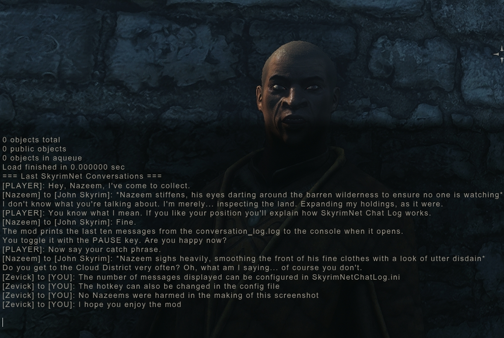

# SkyrimNet Chat Log

A simple SKSE plugin that prints the SkyrimNet conversation log to the console 

<p align="center">
  
</p>

## Features

- Automatically displays recent SkyrimNet conversations when opening the console
- Configurable number of messages to display (default: 10)
- Configurable hotkey (default: PAUSE) to toggle auto-display on/off
- Reads directly from SkyrimNet's conversation log file
- Strips timestamps and "[NPC]" prefixes for clean display

## Requirements

1. [SKSE64](https://skse.silverlock.org/)
2. [Address Library for SKSE Plugins](https://www.nexusmods.com/skyrimspecialedition/mods/32444/)
3. [SkyrimNet](https://github.com/MinLL/SkyrimNet-GamePlugin/)

## Configuration

Edit `/SKSE/Plugins/SkyrimNetChatLog.ini`:

```ini
; Hotkey scancode to toggle auto-display (default: PAUSE=197, works globally)
ToggleHotkey=197

; Number of recent SkyrimNet messages to display (1-100)
MessageCount=10
```

## Usage

1. Open the console (~)
2. Recent SkyrimNet conversations will automatically print to the console 
3. Press PAUSE (or your configured key) anytime to toggle auto-display on/off

## Credits

- CommonLibSSE-NG
- SkyrimNet
